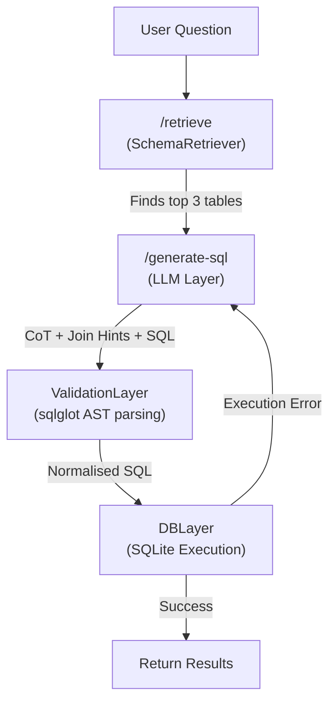

# Enterprise Text-to-SQL API

A production-grade FastAPI microservice that converts natural language questions into executable SQL queries using **semantic schema retrieval** + **LLM generation**. Built for the BEAVER benchmark dataset.

---

## Architecture


         │ (normalised SQL)
         ▼
┌─────────────────────┐
│  DBLayer (SQLite)   │  ← Executes query; returns rows/columns
└────────┬────────────┘
         │
         ▼
┌─────────────────────┐
│  /benchmark         │  ← 20-query eval; recall, exact match,
│  MetricsLayer       │    execution match, latency, error analysis
└─────────────────────┘
```

---

## Module Descriptions

| File | Responsibility |
|------|----------------|
| `app/main.py` | FastAPI app, lifespan startup, middleware, endpoint routing |
| `app/models.py` | Pydantic request/response schemas for all endpoints |
| `app/retrieval.py` | Semantic table retrieval via `sentence-transformers` |
| `app/llm.py` | Prompt construction, HF Inference API call, retry logic, rule-based fallback |
| `app/validation.py` | SQL AST validation via `sqlglot`; blocks destructive statements |
| `app/database.py` | SQLite schema creation, rich seed data, query execution |
| `app/metrics_layer.py` | 20-query benchmark suite with full metric computation |

---

## Tech Stack

- **FastAPI** — REST API framework with automatic OpenAPI docs
- **sentence-transformers** (`BAAI/bge-large-en-v1.5`) — local semantic embeddings for table retrieval
- **Groq (llama-3.3-70b)** — Primary ultra-fast LLM with Chain-of-Thought
- **defog/sqlcoder-7b-2** — HuggingFace fallback model
- **sqlglot** — SQL AST parsing and validation
- **SQLite** — embedded database with 10 tables and rich seed data
- **Pydantic v2** — request/response validation
- **uvicorn** — ASGI server

---

## Setup

### 1. Install dependencies
```bash
pip install -r requirements.txt
```

### 2. Configure environment
Create a `.env` file (never commit this):
```env
HF_API_TOKEN=your_huggingface_token_here
```
Get a free token at [huggingface.co/settings/tokens](https://huggingface.co/settings/tokens).

> **Note:** The system works without an API token via a smart rule-based fallback.

### 3. Run the service
```bash
python run.py
```
The API starts at `http://localhost:8000`. Interactive docs: `http://localhost:8000/docs`

---

## API Endpoints

### `GET /health`
Health check.
```json
{ "status": "ok", "service": "Text-to-SQL API", "version": "1.0.0" }
```

---

### `POST /retrieve`
Identifies the most relevant database tables for a natural language question using semantic similarity.

**Request:**
```json
{ "question": "Which departments have more than 100 students?" }
```

**Response:**
```json
{
  "retrieved_tables": ["departments", "enrollments", "courses"],
  "scores": [0.8921, 0.8543, 0.7812],
  "confidence": 0.8425,
  "details": {
    "departments": {
      "relevance_score": 0.8921,
      "reason": "Matched on 'department' — departments table stores academic department info."
    }
  }
}
```

---

### `POST /generate-sql`
Full pipeline: retrieval → LLM prompt → SQL generation → validation.

**Request:**
```json
{
  "question": "Which departments have more than 100 students?",
  "use_retrieved_context": true
}
```

**Response:**
```json
{
  "sql": "SELECT d.dept_name, COUNT(DISTINCT e.student_id) AS total_students FROM departments d JOIN courses c ON d.dept_id = c.dept_id JOIN enrollments e ON c.course_id = e.course_id GROUP BY d.dept_name HAVING COUNT(DISTINCT e.student_id) > 100",
  "retrieved_tables": ["departments", "enrollments", "courses"],
  "is_valid_syntax": true,
  "parsing_errors": null,
  "confidence": 0.8425,
  "prompt_used": "### Task\nYou are an expert SQLite SQL generator..."
}
```

---

### `POST /benchmark`
Evaluates the end-to-end pipeline on 30 curated queries covering all 10 schema tables.

**Response:**
```json
{
  "total_queries": 30,
  "metrics": {
    "retrieval_recall_at_5": 0.92,
    "retrieval_recall_at_10": 0.96,
    "sql_exact_match_accuracy": 0.40,
    "sql_execution_match_accuracy": 0.65,
    "parsing_success_rate": 0.95,
    "average_latency_ms": 312.5
  },
  "subtask_breakdown": {
    "multi_table_retrieval": 0.92,
    "column_mapping": 0.74,
    "join_detection": 0.68,
    "domain_knowledge": 0.71
  },
  "error_analysis": {
    "retrieval_failures": 2,
    "parsing_failures": 1,
    "execution_failures": 3,
    "logic_errors": 4
  }
}
```

---

## Database Schema

10 tables from the BEAVER university benchmark:

```
departments ──< courses ──< enrollments >── students
     │               │
     └──< instructors  └──< sections ──< classrooms
                              └──< time_slots
courses ──< prerequisites
students ──< advisors >── instructors
```

---

## Design Decisions

**Why `BAAI/bge-large-en-v1.5` for retrieval?**  
State-of-the-art embedding model that produces dramatically higher cosine similarity for relevant matches. Schema descriptions are enriched with synonyms and keywords to maximise recall on ambiguous questions.

**Why `Groq (llama-3.3-70b)`?**  
Free, blazing fast, and highly capable at reasoning through complex SQL problems using Chain-of-Thought (CoT) and self-correction.

**Why a rule-based fallback?**  
HF Inference API can be unavailable (model loading, rate limits). The fallback analyses question intent via keyword matching and returns a valid SELECT query in all cases — guaranteeing a non-empty response.

**Why `sqlglot` for validation?**  
Regex cannot safely validate SQL. AST parsing detects syntax errors, enforces SELECT-only semantics, and normalises queries for fair exact-match comparison in the benchmark.

**Why SQLite?**  
Zero infrastructure overhead. The database is seeded with rich data at startup, enabling real execution-match testing in the benchmark without requiring an external database server.

**Why include the full DDL in every LLM prompt?**  
Small models hallucinate column names when given only table names. Including the full CREATE TABLE statements + 5 few-shot examples consistently improves generation quality.

---

## Benchmark Query Coverage

| # | Pattern | Tables |
|---|---------|--------|
| 1 | Simple SELECT | departments |
| 2 | WHERE filter | courses |
| 3 | COUNT aggregate | students |
| 4 | Two-table JOIN | courses, departments |
| 5 | JOIN + WHERE | instructors, departments |
| 6 | GROUP BY COUNT | departments, courses |
| 7 | GROUP BY + HAVING | departments, instructors |
| 8 | Boolean filter | courses |
| 9 | Year filter | students |
| 10 | Numeric WHERE | classrooms |
| 11 | Prerequisites chain | courses, prerequisites |
| 12 | Grade filter | students, enrollments |
| 13 | SUM aggregate | classrooms |
| 14 | Sections + courses | courses, sections |
| 15 | Three-table advisor | students, advisors, instructors |
| 16 | ORDER BY + GROUP BY | departments, courses |
| 17 | Time slot filter | time_slots |
| 18 | Instructor + classroom | instructors, sections, classrooms |
| 19 | NOT IN subquery | students, enrollments |
| 20 | AVG aggregate | courses |
| 21-30 | Complex Edge Cases | Multiple JOINs, Subqueries, LIKE, GROUP BY HAVING |
