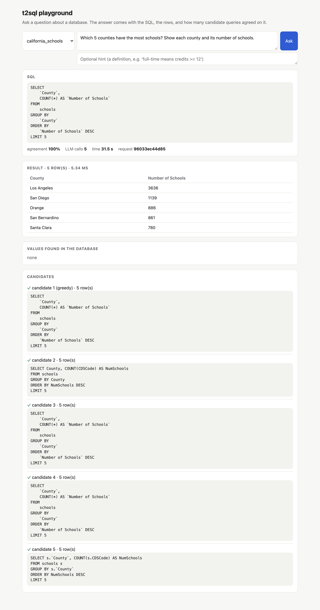
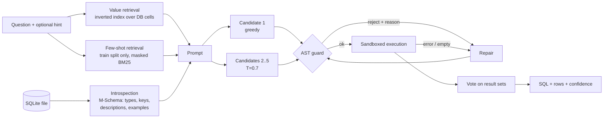

# t2sql — Text-to-SQL you can measure and can't break

[](https://github.com/saitejacodes/text-to-sql-api/actions/workflows/ci.yml)  

Ask a question in English, get a SQLite query and its result. Works on **any** SQLite database
(schema, keys, sample values and cell values are read from the file), runs on a **local 7B model**
(Ollama) or any OpenAI-compatible API, and treats every generated query as untrusted code.

<!-- RESULTS:START -->
### Results — BIRD mini-dev (SQLite), 498 scorable questions, 11 databases, local `qwen2.5-coder:7b`

| Configuration (each row adds one idea) | Execution accuracy [95% CI] | Δ | McNemar p | Hard questions | Corrected gold |
|---|---|---|---|---|---|
| Baseline: plain schema, one greedy answer | 45.6 [41.4–49.8] | | | 34.7 | 42.3 |
| + column descriptions & example values (M-Schema) | 49.2 [44.8–53.6] | +3.6 | 0.018 | 39.6 | 46.4 |
| + database-value retrieval | 48.8 [44.4–52.8] | −0.4 | 0.88 | 38.6 | 46.0 |
| + 3 few-shot examples from the *train* split | 50.4 [45.8–54.6] | +1.6 | 0.40 | 41.6 | 46.2 |
| + execution-feedback repair | 53.8 [49.2–58.0] | +3.4 | <0.001 | 43.6 | 49.6 |
| **+ 5-way vote on execution results (full system)** | **58.4 [53.8–62.7]** | **+4.6** | **<0.001** | **50.5** | **54.2** |

- **+12.8 points** end to end on a free laptop model (+15.8 on the hardest questions). Schema context,
  repair and voting carry the gain; value retrieval and few-shot were *not* significant with this model —
  reported as measured, not tuned away.
- **Agreement is a usable confidence signal:** 5/5 candidates agree → 79.6% correct (211 questions);
  ≤ 2/5 agree → 28.0% (100 questions). A caller can route low-agreement answers to a human.
- **Two answer keys:** the same predictions are scored against BIRD's official SQL and against
  expert-corrected SQL (Arcwise-Plat-SQL, 179 of 498 answers differ) — no cherry-picking.
- **Pipeline > model swap:** replacing the model with the SQL-specialised OmniSQL-7B (same pipeline,
  stratified 150-question subset) gave 58.7% vs 62.0% — no significant difference (McNemar p = 0.42).
  OmniSQL's published scores use its own prompt format; under this pipeline the extra specialisation
  did not add accuracy.
- **Context, not a leaderboard claim:** zero-shot GPT-4 ≈ 46–48 on BIRD dev; SQL-specialised 7B models
  64–69; leaderboard top ≈ 82.

Full report (error taxonomy, calibration, cost/latency, model swap): [runs/REPORT.md](runs/REPORT.md) ·
method: [docs/EVALUATION.md](docs/EVALUATION.md) · design rationale: [docs/DESIGN_NOTES.md](docs/DESIGN_NOTES.md).
<!-- RESULTS:END -->



## Why this exists (what v1 got wrong)

v1 reported 72% accuracy on 30 questions that were also in its few-shot pool, answered by a
550-line regex "CoT layer" written for those questions, on a 60-row toy database. v2 withdraws
that number and rebuilds the system around an honest benchmark:
[docs/EVALUATION.md](docs/EVALUATION.md) explains every change.

## How it works



| Stage | What it does | Why |
|---|---|---|
| **Introspection** (`db/introspect.py`) | Reads tables, PK/FK, 3 example values per column, and BIRD-style column descriptions; renders M-Schema | Example values tell the model that `Currency` holds `'EUR'`, not `'euro'` |
| **Value retrieval** (`retrieval/value_index.py`) | Inverted index over every distinct text value (≤ 50k per column), fuzzy-matched to the question | Most runnable-but-wrong SQL on real data is a literal mismatch (`'Alameda'` vs "alameda county") |
| **Few-shot retrieval** (`retrieval/fewshot.py`) | DAIL-SQL-style: mask entities, BM25 over **BIRD train** questions; examples from the evaluated databases are excluded | Teaches SQL idioms without ever showing an answer |
| **Candidates + vote** (`pipeline/pipeline.py`) | 1 greedy + 4 sampled queries, grouped by *execution result* | Differently written queries that return the same rows count as agreement; group size = confidence |
| **Repair** | Up to 2 rounds on guard/execution errors, 1 round on empty/all-NULL results (kept only if it then returns rows) | Cheap fix for wrong column names and wrong join paths |

### Security model: defence in depth

Generated SQL is untrusted input (the model can be prompt-injected through values stored in the
database). Two independent layers each block the attack suite in `tests/test_redteam.py`, and the
database file is hashed before and after every attack:

1. **AST guard** (`guard/sql_guard.py`, sqlglot): exactly one statement, must be a query, no
   DDL/DML/PRAGMA/ATTACH anywhere in the tree, only known tables, no `load_extension`/`readfile`.
   Keyword matching is not used, so `SELECT created_at` and `WHERE status = 'Deleted'` are fine.
2. **Sandbox** (`db/executor.py`): `mode=ro` file handle + `PRAGMA query_only` + a SQLite
   **authorizer** that permits only read/select/function actions (blocks `VACUUM INTO`, temp
   triggers, ATTACH even if the guard were bypassed) + wall-clock timeout + row cap.

## Quick start

```bash
make install && make demo                      # builds examples/university.sqlite
ollama pull qwen2.5-coder:7b                   # or point T2SQL_LLM_* at Groq/OpenAI (.env.example)
.venv/bin/t2sql ask --db examples/university.sqlite "Which instructors teach in the Stata Center?"
.venv/bin/t2sql serve                          # http://127.0.0.1:8000/docs
```

```bash
curl -s localhost:8000/v1/query -H 'content-type: application/json' \
  -d '{"db": "university", "question": "How many students took a course in the Computer Science department?"}'
```

The response contains the SQL, the rows, a confidence (share of candidates that agree), the value
hints used, and every candidate with its repair count — enough to debug any answer.

| Endpoint | |
|---|---|
| `POST /v1/query` | question → SQL, rows, confidence, candidate trace |
| `POST /v1/validate` | run the guard on hand-written SQL |
| `GET /v1/databases`, `GET /v1/databases/{db}/schema` | what can be queried, and the exact schema text the model sees |
| `GET /health` | liveness |

Set `T2SQL_API_KEYS=key1,key2` to require an `X-API-Key` header on `/v1/*`. Docker:
`docker compose up` (mount your own `.sqlite` files into `examples/`, read-only).

## Reproduce the benchmark

```bash
scripts/get_bird.sh        # BIRD mini-dev + corrected gold + train few-shot pool (~1.5 GB)
make eval-all              # bare -> mschema -> values -> full; resumable, LLM calls cached
for r in runs/*/; do .venv/bin/t2sql rescore $r; done   # score vs corrected gold, no LLM calls
make report                # runs/REPORT.md
```

## Engineering notes

- **Tests:** 70+ tests, no network needed (scripted fake LLM): guard, sandbox, red-team suite,
  introspection, value retrieval, repair/vote logic, metrics, resumable eval, API incl. auth.
- **Reproducibility:** every LLM response is cached by a hash of the full request, so re-running
  a report is free and an ablation only pays for calls that changed; runs resume after interruption.
- **Local-first performance:** candidates are generated sequentially so the local server reuses
  the shared prompt prefix; value indexes are built once per database and cached on disk.
- **Observability:** JSON logs with request ids, `x-process-time-ms`, per-question token/latency
  accounting in eval output.

## Limitations

- SQLite only (the guard and introspection are dialect-aware via sqlglot; the sandbox is SQLite-specific).
- Confidence is agreement, not probability; the report shows how accuracy varies with it.
- BIRD gold SQL is itself noisy — hence the second score against expert-corrected answers.
